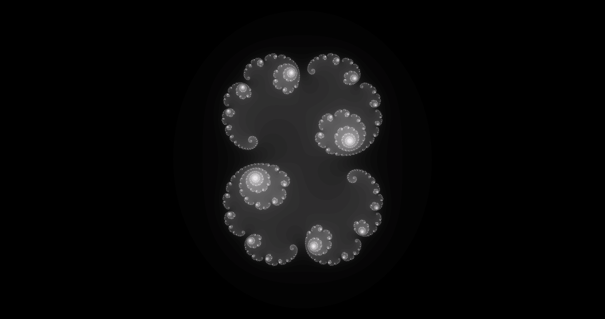
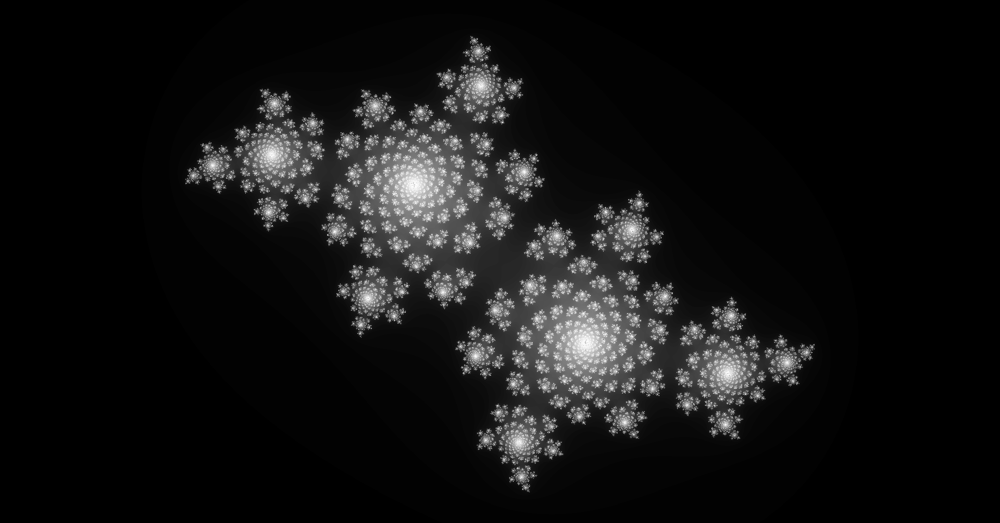
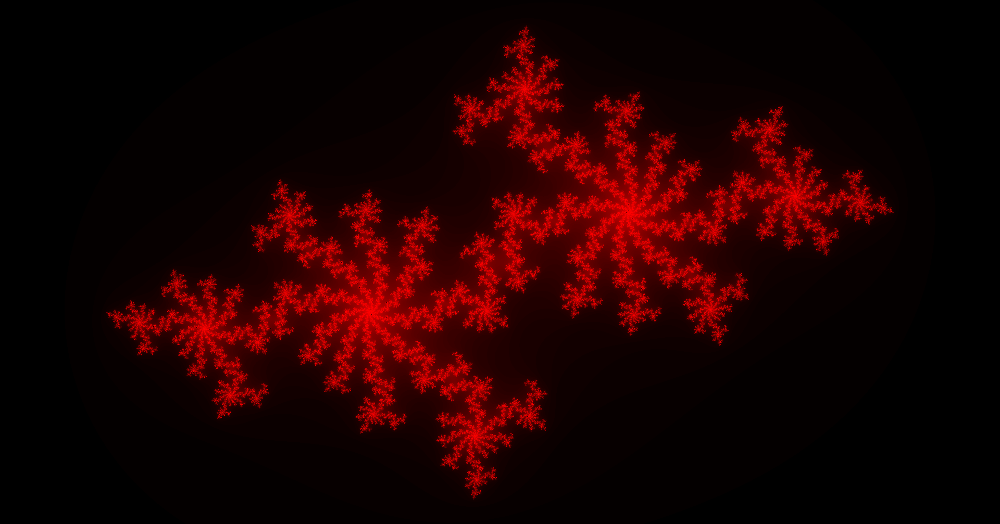
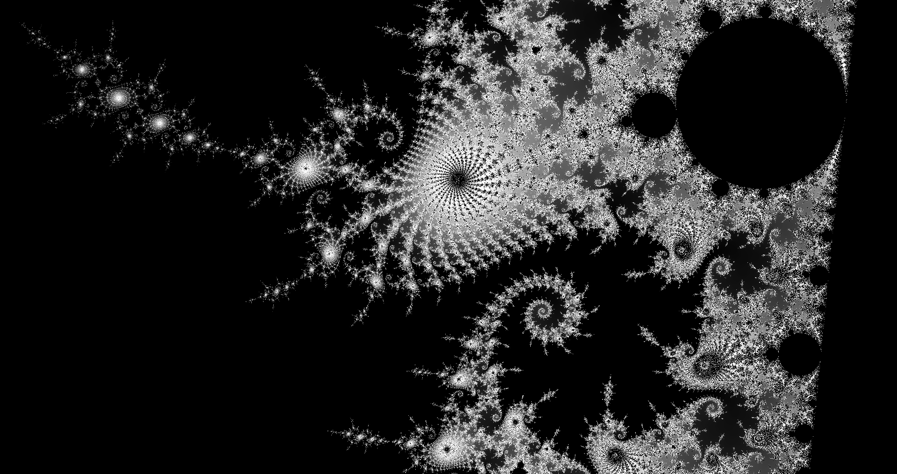
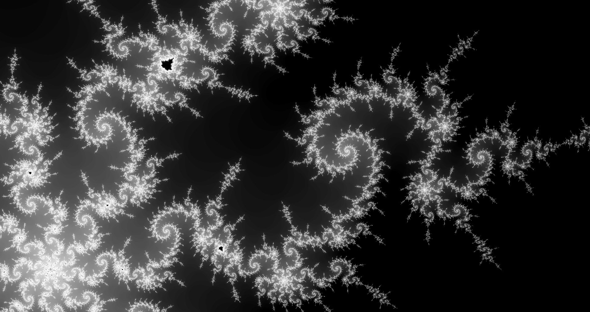
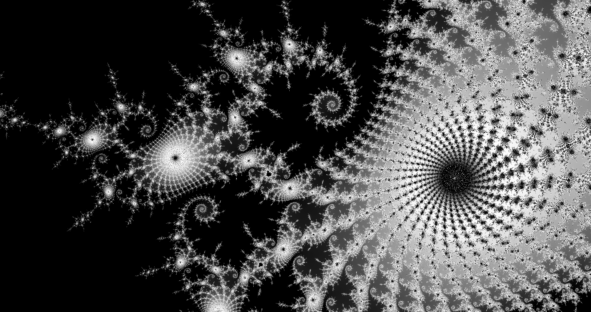
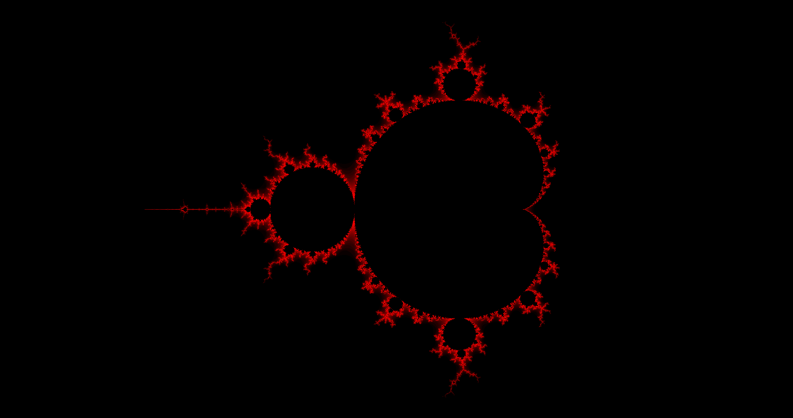
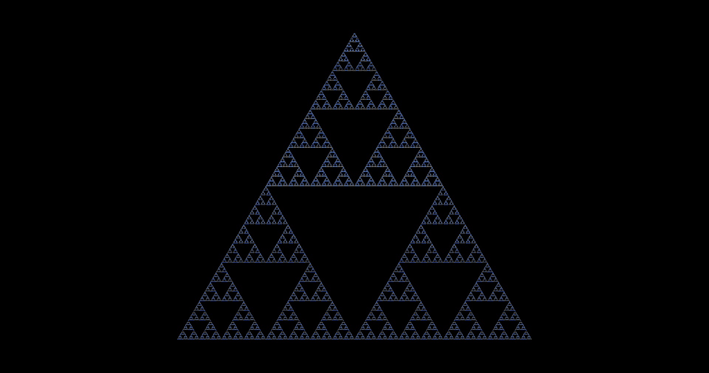
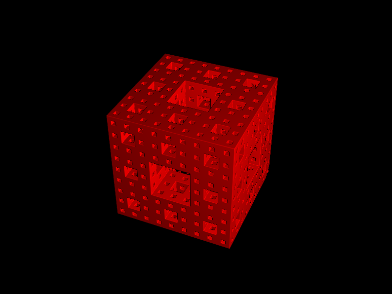

# FractalsGL

Fractals with shaders.

## About

[FractalsGL](./FractalsGL/) is the original SDL2 C++ project.  
[seminarska_naloga_fraktali_2018](./seminarska_naloga_fraktali_2018/) is a Python implementation of FractalsGL, done as a high school project.

The bulk of work in both projects is in the OpenGL vertex and fragment shaders.

Fractals implemented:  
 * **Mandelbrot** fractal, 
 * **Julia** fractal,
 * **Sierpinski** triangle (only in the Python version),
 * **Menger** sponge (only in FractalsGL).

Note: I recommend running the python version of the program, since it is more polished.

## FractalsGL

FractalsGL is a C++ project using SDL2, glad and [glm](https://glm.g-truc.net).

The ray marching examples (_simple_raymarcher.fs_) are based on work done by [Inigo Quilez](http://www.iquilezles.org/).

### Usage
  * **Mouse wheel**  to zoom,
  * **Left**, **Right**, **Up**, **Down** arrow keys to move the camera,  
  * **A**, **S**, **D**, **F** to change the complex _c_ parameter (Julia set),
  * **Q** and **E** to decrease/increase the number of iterations used for drawing,  
  * **N** for next fractal.

### Build

  1. Open _FractalsGL.sln_.
  2. Include and link SDL2, glad and glm.
  3. Build project FractalsGL.
  4. Copy _SDL2.dll_ to output directory.

## Seminarska naloga (high school project)

Because this was a high school project, comments and debug messages are in Slovene.  

Written using Python 3 and the following libraries:
 * [ModernGL](https://github.com/moderngl/moderngl) (5.0.7) and
 * [pyglet](https://pyglet.readthedocs.io/) (1.3.0).

### Usage
  * **Mouse wheel**  to zoom,
  * **Left**, **Right**, **Up**, **Down** arrow keys to move the camera,  
  * **A**, **S**, **D**, **F** to change the complex _c_ parameter (Julia set),
  * **Q** and **E** to decrease/increase the number of iterations used for drawing,  
  * **N** for next fractal,
  * **P** print information about current fractal,
  * **R** randomize fractal color,
  * **1**, **2**, **3** to change the red, green and blue color components respectively.

## Screenshots

